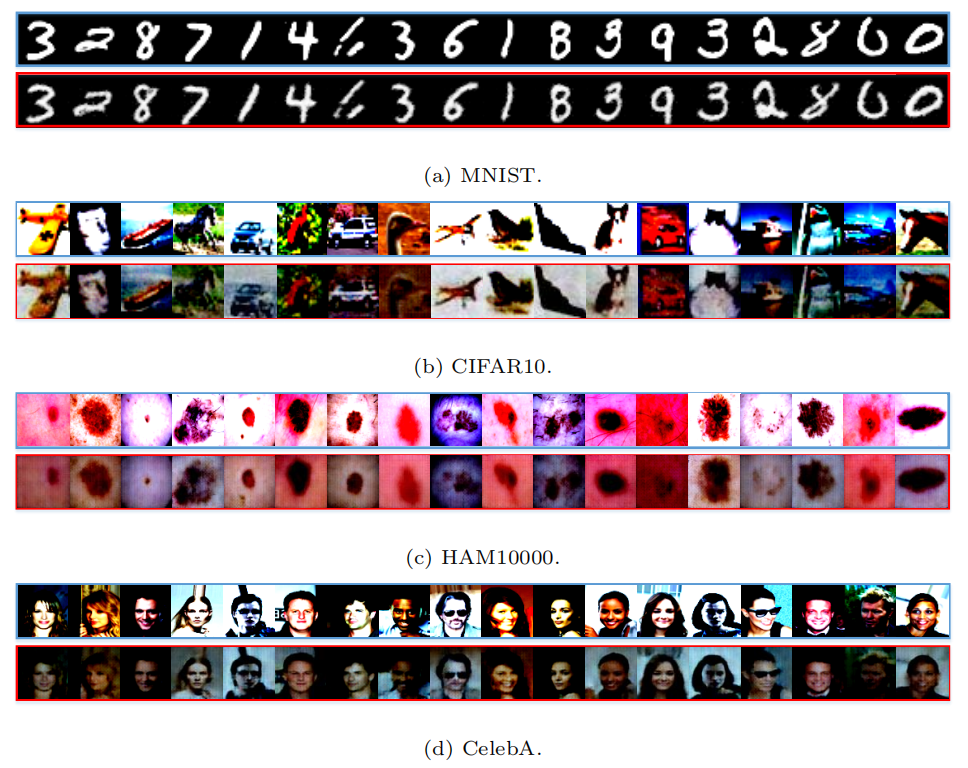

## Requirements

- python 3
- pytorch >= 1.0.0
- torchvision

## Run the demo

```
python SFL_MNIST.py
```

First, you should perform split federated learning protocol.

```
python main.py --dataset MNIST --n_epochs 200 --split 1 --N 4 --floder mnist_1_4
```

Then, you can run the proposed attack.


To run experiment on the HAM dataset

```
python SFLV1_ResNet_HAM10000.py

python main.py --dataset HAM --n_epochs 200 --lr2 0.01 --split 1 --N 4 --floder HAM_1_4
```


To run experiment on the CelebA dataset

```
python SFLV1_ResNet_CelebA.py

python main.py --dataset CelebA --n_epochs 200 --lr2 0.001 --split 1 --N 4 --floder CelebA_1_4
```

## Results

